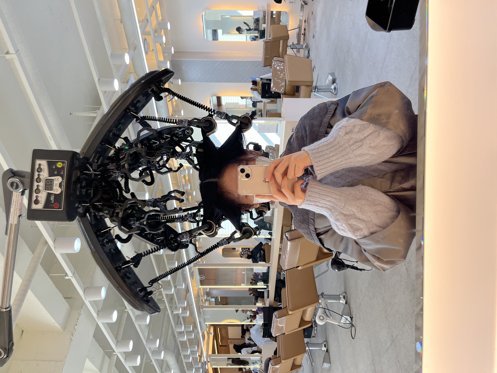
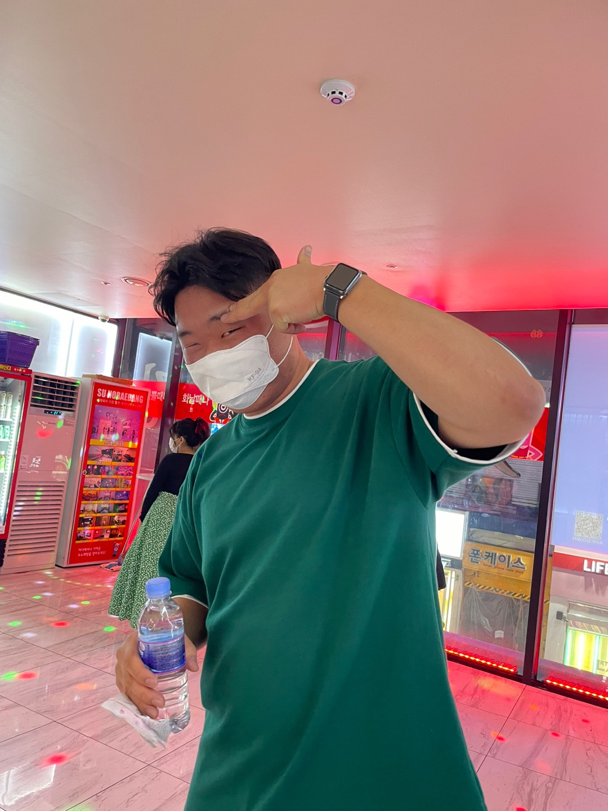
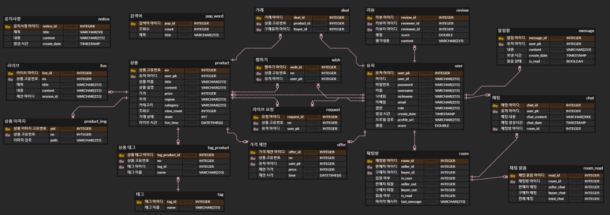
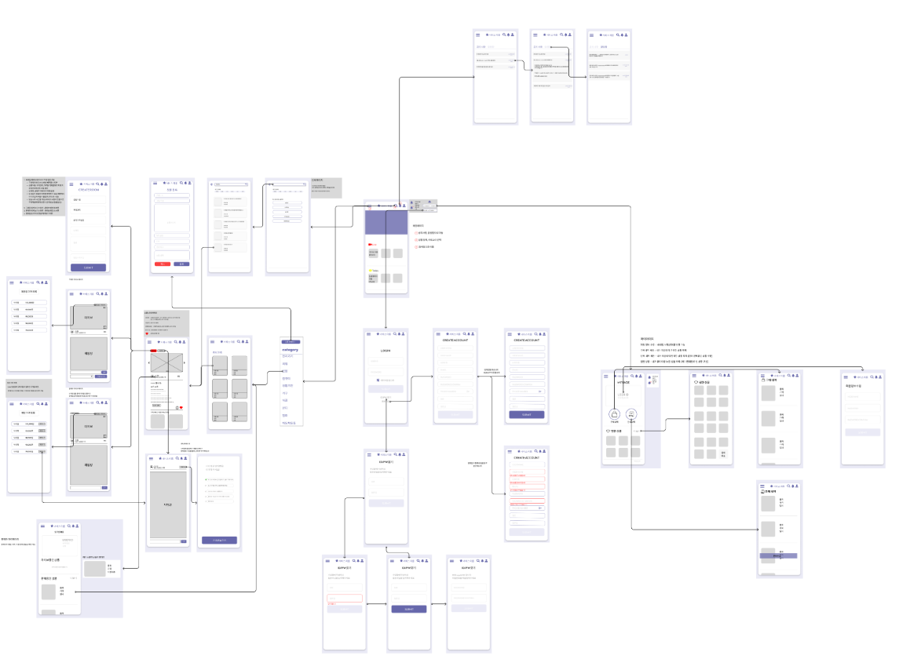
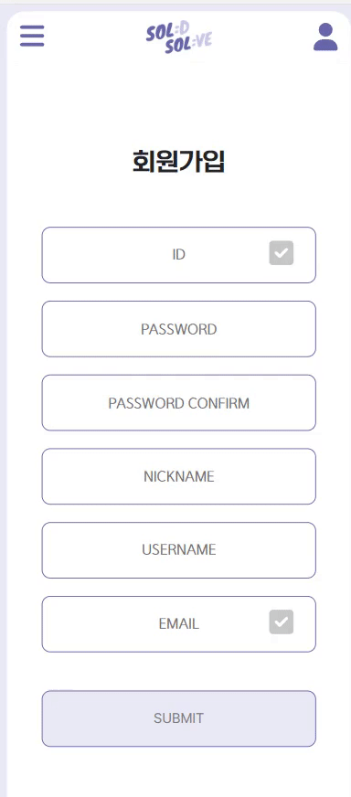
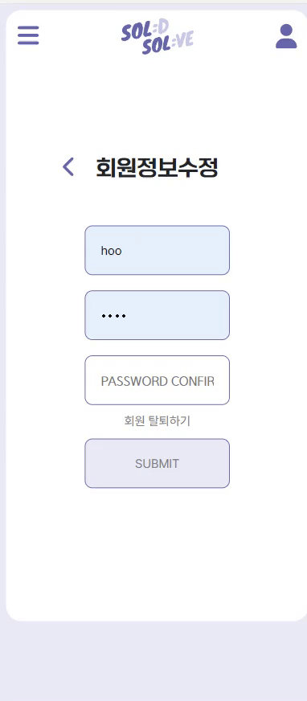
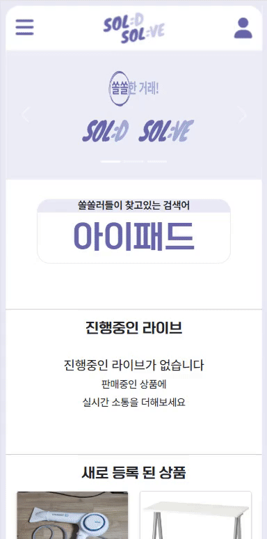
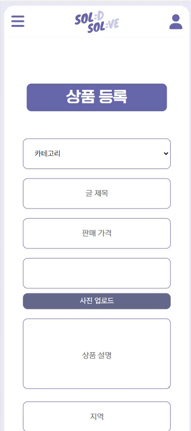
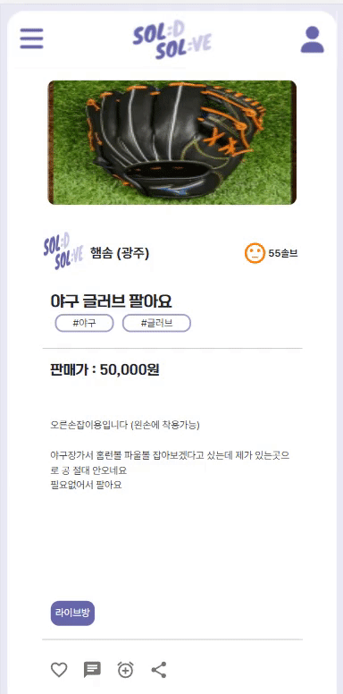
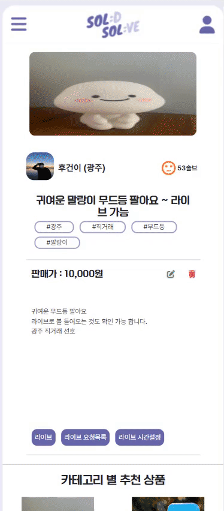

# SOL:D SOL:VE (구매와 판매의 재미를 쏠쏠하게)

----------

---

## 📃 카테고리

| Application                       | Domain                                | Language                         | Framework                            |
| --------------------------------- | ------------------------------------- | -------------------------------- | ------------------------------------ |
| :white_check_mark: Desktop Web    | :black_square_button: AI              | :white_check_mark: JavaScript    | :black_square_button: Vue.js         |
| :white_check_mark: Mobile Web     | :black_square_button: Big Data        | :black_square_button: TypeScript | :white_check_mark: React             |
| :white_check_mark: Responsive Web | :black_square_button: Blockchain      | :black_square_button: C/C++      | :black_square_button: Angular        |
| :black_square_button: Android App | :black_square_button: IoT             | :black_square_button: C#         | :black_square_button: Node.js        |
| :black_square_button: iOS App     | :black_square_button: AR/VR/Metaverse | :black_square_button: Python     | :black_square_button: Flask/Django   |
| :black_square_button: Desktop App | :black_square_button: Game            | :white_check_mark: Java          | :white_check_mark: Spring/Springboot |
|                                   |                                       | :black_square_button: Kotlin     |                                      |

---

## 🗯팀 소개

  <table>
    <tr>
        <td><b>이름</td>
        <td>
  사진
  </td>
  <td>
  역할
  </td>
    </tr>  
    <tr>
        <td><b>조영훈/팀장</td>
        <td>
  
  </td>
  <td>
  Backend
  </td>
    </tr>  
    <tr>
        <td><b>이민재/팀원</td>
        <td>
  
  </td>
  <td>
  Backend
  </td>
    </tr>  
    <tr>
        <td><b>문유주/팀원</td>
        <td>
  
  <td>
  Frontend
  </td>
    </tr>  
    <tr>
        <td><b>오행송/팀원</td>
        <td>
  
  </td>
  <td>
  Frontend
  </td>
    </tr>  
    <tr>
        <td><b>이건후/팀원</td>
        <td>
  
  <td>
  Frontend
  </td>
    </tr>

---

## 💡 프로젝트 소개

`SOL:D SOL:VE`는 '판매를 해결해주는 해결사' 역할을 해주고 '판매와 구매를 쏠쏠하게' 라는 슬로건을 내세운 서비스 입니다.

> LIVE를 통해 중고물품을 보다 더 안전하게 **거래**하세요! 😆

---

## 🔧 기술 스택 & 서비스 아키텍쳐

#### - 기술스택

<table>
  <tr>
      <td>Back-end</td>
      <td>
        
        
        
         
        
        
        
         
        
        
      </td>
  </tr>
  <tr> 
    <td><b>Front-end</td>
    <td>
    
    
    
    
    
    
     
    </td>
  <tr>
  <td><b>Tools</td>
    <td>
    
      
    
    
      
      
    </td>
  

#### - 서비스 아키텍쳐

---

## 🎨 ERD & 와이어 프레임

#### ERD ([soldsolve](https://www.erdcloud.com/d/LuCmPYaPja8RydSq2))

#### 와이어 프레임([Figma](https://www.figma.com/file/kqc2OKTWIuCB0keh8R1J2g/solsol-%EC%99%80%EC%9D%B4%EC%96%B4%ED%94%84%EB%A0%88%EC%9E%84?node-id=0%3A1))

---

## 🔎 기술 소개

### 모든기기에 맞춘 반응형 웹, 라이브를 통한 판매 기능, 상호평가, 1:1채팅
#### 회원가입 & 로그인&nbsp;&nbsp;&nbsp;&nbsp;&nbsp;&nbsp;&nbsp;&nbsp;&nbsp;&nbsp;&nbsp;&nbsp;&nbsp;&nbsp;&nbsp;&nbsp;&nbsp;&nbsp;&nbsp;&nbsp;&nbsp;&nbsp;&nbsp;&nbsp;&nbsp;&nbsp;&nbsp;&nbsp;&nbsp;&nbsp;&nbsp;&nbsp;&nbsp;&nbsp;&nbsp;&nbsp;&nbsp;&nbsp;&nbsp;&nbsp;회원 탈퇴

&nbsp;&nbsp;&nbsp;&nbsp;&nbsp;&nbsp;&nbsp;&nbsp;  

>사용자는 유효성 검증을 통해 회원가입을진행 할 수 있고,
>
> 필요 시 마이페이지를 통해 회원 수정과, 탈퇴가 가능합니다.

#### 메인페이지&nbsp;&nbsp;&nbsp;&nbsp;&nbsp;&nbsp;&nbsp;&nbsp;&nbsp;&nbsp;&nbsp;&nbsp;&nbsp;&nbsp;&nbsp;&nbsp;&nbsp;&nbsp;&nbsp;&nbsp;&nbsp;&nbsp;&nbsp;&nbsp;&nbsp;&nbsp;&nbsp;&nbsp;&nbsp;&nbsp;&nbsp;&nbsp;&nbsp;&nbsp;&nbsp;&nbsp;&nbsp;&nbsp;&nbsp;&nbsp;&nbsp;&nbsp;&nbsp;&nbsp;&nbsp;&nbsp;&nbsp;&nbsp;&nbsp;&nbsp;&nbsp;마이페이지 & 회원정보 수정

&nbsp;&nbsp;&nbsp;&nbsp;&nbsp;&nbsp;&nbsp;&nbsp;
 

>마이페이지를 통한 회원 수정이 가능하며 본인의 프로필 사진을 수정하거나 구매한 내역, 판매중인 내역을 확인 할 수 있고, 찜한 상품을 확인 할 수 있습니다.

#### 검색 & 태그검색&nbsp;&nbsp;&nbsp;&nbsp;&nbsp;&nbsp;&nbsp;&nbsp;&nbsp;&nbsp;&nbsp;&nbsp;&nbsp;&nbsp;&nbsp;&nbsp;&nbsp;&nbsp;&nbsp;&nbsp;&nbsp;&nbsp;&nbsp;&nbsp;&nbsp;&nbsp;&nbsp;&nbsp;&nbsp;&nbsp;&nbsp;&nbsp;&nbsp;&nbsp;&nbsp;&nbsp;&nbsp;&nbsp;&nbsp;&nbsp;&nbsp;&nbsp;&nbsp;상품등록

&nbsp;&nbsp;&nbsp;&nbsp;&nbsp;&nbsp;&nbsp;
 

> 카테고리별로 검색이 가능하고, #(검색어)를 통해 태그 검색 또한 가능합니다. 검색 후 최근에 검색 한 내용이 나타나게 되고, 현재 검색률이 가장 높은 검색어 또한 나타 납니다.
> 
> 좌상단 햄버거바를 이용하여 상품 등록을 할 수 있으며, 등록 시 판매 지역과 태그 또한 등록이 가능합니다. 

#### 찜하기 & 링크 복사 & 채팅하기(판매자)&nbsp;&nbsp;&nbsp;&nbsp;&nbsp;&nbsp;&nbsp;&nbsp;&nbsp;&nbsp;&nbsp;라이브 시간 설정 & 라이브 요청목록 & 라이브

&nbsp;&nbsp;&nbsp;&nbsp;&nbsp;&nbsp;&nbsp;&nbsp; 

> 상품 상세 페이지를 통해 판매자는 구매자에게 라이브 요청과 채팅을 할 수 있으며, 상품이 마음에 들 경우 좋아요를 통해 찜한 상품을 등록 할 수 있습니다.
> 
> 구매자는 본인이 등록한 상품의 상세 페이지를 통해 라이브 요청 목록을 확인하고, 목록들의 사람들에게 시간을 설정함으로써 해당 시간에 방송하겠다는 알림을 보내줍니다. 그 후 라이브 버튼을 통해 라이브 방송을 진행 할 수 있습니다.

#### 라이브 & 채팅 & 가격제안&nbsp;&nbsp;&nbsp;&nbsp;&nbsp;&nbsp;&nbsp;&nbsp;&nbsp;&nbsp;&nbsp;&nbsp;&nbsp;&nbsp;&nbsp;&nbsp;&nbsp;&nbsp;&nbsp;&nbsp;&nbsp;&nbsp;&nbsp;&nbsp;&nbsp;&nbsp;&nbsp;&nbsp;&nbsp;&nbsp;&nbsp;채팅 & 평가(판매자)

&nbsp;&nbsp;&nbsp;&nbsp;&nbsp;&nbsp;&nbsp;&nbsp; 

> 구매자는 판매자의 라이브를 들어가 채팅을 할 수 있으며 거래에 대한 금액 제안을 할 수 있습니다. 그 후, 판매자 혹은 구매자는 채팅을 통해 판매를 완료하고 서로를 상호 평가할 수 있습니다.