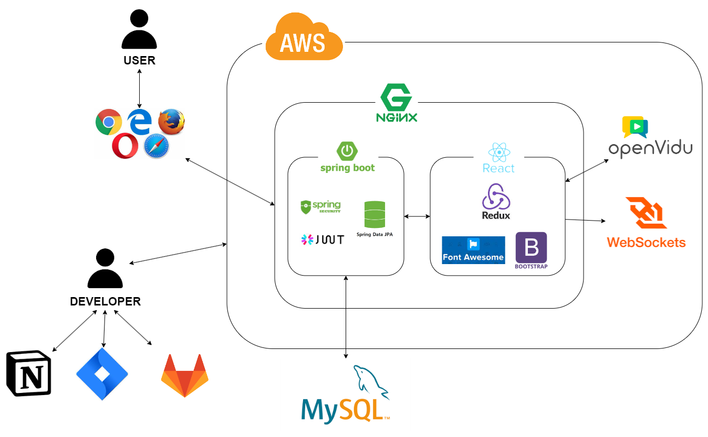

# SOL:D SOL:VE (구매와 판매의 재미를 쏠쏠하게)

----------

---

## 📃 카테고리

| Application                       | Domain                                | Language                         | Framework                            |
| --------------------------------- | ------------------------------------- | -------------------------------- | ------------------------------------ |
| :white_check_mark: Desktop Web    | :black_square_button: AI              | :white_check_mark: JavaScript    | :black_square_button: Vue.js         |
| :white_check_mark: Mobile Web     | :black_square_button: Big Data        | :black_square_button: TypeScript | :white_check_mark: React             |
| :white_check_mark: Responsive Web | :black_square_button: Blockchain      | :black_square_button: C/C++      | :black_square_button: Angular        |
| :black_square_button: Android App | :black_square_button: IoT             | :black_square_button: C#         | :black_square_button: Node.js        |
| :black_square_button: iOS App     | :black_square_button: AR/VR/Metaverse | :black_square_button: Python     | :black_square_button: Flask/Django   |
| :black_square_button: Desktop App | :black_square_button: Game            | :white_check_mark: Java          | :white_check_mark: Spring/Springboot |
|                                   |                                       | :black_square_button: Kotlin     |                                      |

<!-- 자유 양식 -->

---

## 🗯팀 소개

<table>
  <tr>
      <td><b>이름</td>
      <td>
사진
</td>
<td>
소개
</td>
  </tr>  
  <tr>
      <td><b>조영훈/팀장/BE</td>
      <td>

</td>
<td>
소개
</td>
  </tr>  
  <tr>
      <td><b>이민재/팀원/BE</td>
      <td>

</td>
<td>
소개
</td>
  </tr>  
  <tr>
      <td><b>문유주/팀원/FE</td>
      <td>

<td>
소개
</td>
  </tr>  
  <tr>
      <td><b>오행송/팀원/FE</td>
      <td>

</td>
<td>
소개
</td>
  </tr>  
  <tr>
      <td><b>이건후/팀원/FE</td>
      <td>

<td>
소개
</td>
  </tr>  

<!-- 자유 양식 -->

---

## 💡 프로젝트 소개

`SOL:D SOL:VE`는 '판매를 해결해주는 해결사' 역할을 해주고 '판매와 구매를 쏠쏠하게' 라는 슬로건을 내세운 서비스 입니다.

> LIVE를 통해 중고물품을 보다 더 안전하게 **거래**하세요! 😆

---

## 🔧 기술 스택 & 서비스 아키텍쳐

#### - 기술스택

<table>
  <tr>
      <td><b>Back-end</td>
      <td>

 

 

</td>
  </tr>
  <tr>
  <td><b>Front-end</td>
  <td>
  
  
  
   
  <!--  -->
  
  
  </td>
  </tr>
  <tr>
  <td><b>Tools</td>
  <td>

<!-- 

 -->

#### - 서비스 아키텍쳐

---

## 🎨 ERD & 와이어 프레임

#### ERD ([soldsolve](https://www.erdcloud.com/d/LuCmPYaPja8RydSq2))

#### 와이어 프레임([Figma](https://www.figma.com/file/kqc2OKTWIuCB0keh8R1J2g/solsol-%EC%99%80%EC%9D%B4%EC%96%B4%ED%94%84%EB%A0%88%EC%9E%84?node-id=0%3A1))

---

## 🔎 기술 소개

#### 회원가입 & 로그인                      회원 탈퇴

                

#### 메인페이지                                  마이페이지 & 회원정보 수정

             

#### 검색 & 태그검색                          상품등록

             

#### 

#### 찜하기 & 링크 복사 & 채팅하기

#### 라이브 & 채팅 & 가격제안       채팅 & 평가 (구매자)

          

